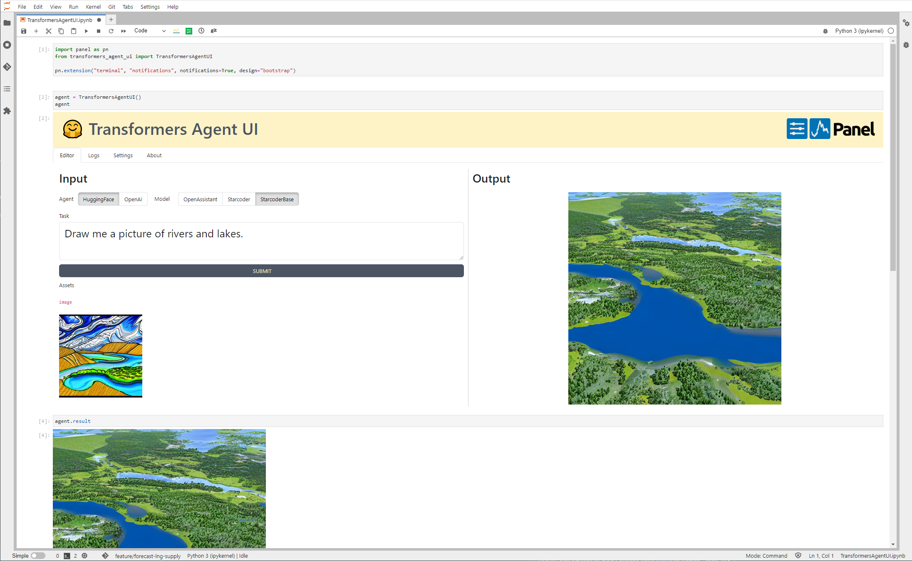
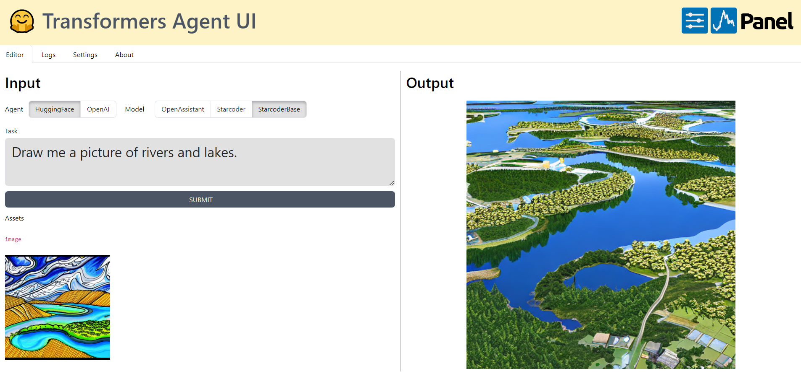

# 🤗 Transformers Agent UI

THIS PROJECT IS CURRENTLY A PROOF OF CONCEPT. DON'T EXPECT EVERYTHING TO WORK! CHECK OUT THE
[TODO LIST](#todo-list) FOR MORE INFO.

We want to

- Make it easy to use the [Hugging Face Transformers Agent](https://huggingface.co/docs/transformers/transformers_agents).

We provide

- the `TransformersAgentUI` component which can be used in the notebook as a web app
- a deployment of the web app on Hugging Face Spaces

You can install and use the package as simple as.

```bash
pip install transformers-agent-ui
```

In a notebook just run

```python
import panel as pn
from transformers_agent_ui import TransformersAgentUI

pn.extension("terminal", "notifications", notifications=True, design="bootstrap")

TransformersAgentUI()
```



To serve as a web app create the file `app.py`

```python
import panel as pn
from transformers_agent_ui import TransformersAgentUI

if pn.state.served:
    pn.extension("terminal", "notifications", notifications=True, design="bootstrap")
    TransformersAgentUI().servable()
```

and run

```bash
BOKEH_RESOURCES=cdn panel serve app.py
```



In order for you to run the inference you will have to provide tokens. Preferably via the
environment variables

- `HUGGING_FACE_TOKEN`
- `OPEN_AI_TOKEN`

Alternatively you can provide them on the *Settings tab* in the app.

## 🚀 Get started in under a minute

Install `transformers-agent-ui` including the *`examples` dependencies*.

```bash
pip install  transformers-agent-ui[examples]
```

Explore the sample apps

```bash
pn hello transformers-agent-ui
```

<!--  -->

You can now find the *reference* and *gallery* notebooks in the `examples/awesome-panel/transformers-agent-ui` folder. Check them out by running `jupyter lab`.

## 📒 Explore the examples online

Click one of the buttons

[](https://nbviewer.org/github/awesome-panel/transformers-agent-ui/tree/main/examples/)
[](https://mybinder.org/v2/gh/awesome-panel/transformers-agent-ui/HEAD)

## ⭐ Support

Please support [Panel](https://panel.holoviz.org) and
[awesome-panel](https://awesome-panel.org) by giving the projects a star on Github:

- [holoviz/panel](https://github.com/holoviz/panel).
- [awesome-panel/awesome-panel](https://github.com/awesome-panel/awesome-panel).

Thanks

## ❤️ Contribute

If you are looking to contribute to this project you can find ideas in the [issue tracker](https://github.com/awesome-panel/transformers-agent-ui/issues). To get started check out the [DEVELOPER_GUIDE](DEVELOPER_GUIDE.md).

I would love to support and receive your contributions. Thanks.

[](https://github.com/awesome-panel/transformers-agent-ui/issues).

## Monitor

[](https://pypi.org/project/transformers-agent-ui/)
[](https://pepy.tech/project/transformers-agent-ui)

[](https://opensource.org/licenses/MIT)


## Todo List

- [x] Implement TokenManager
- [ ] Redirect log to Terminal AND to stdout for easier debugging
- [x] Save every run - also when cache is hit
- [ ] Add three examples to make it easy to get started
- [x] Add notification if no token is available
- [ ] Deploy to Pypi
- [ ] Deploy to Hugging Face
- [ ] Support dynamic arguments (text, image etc) to run function
- [ ] Multi user support
  - [ ] Restrict logs to user session
  - [ ] Restrict store to user session
- [ ] Don't save asset if from cache. Instead reuse.
- [ ] Save run prints to logs
- [ ] Support `remote` parameter setting
- [ ] Support `return_code` parameter setting
- [ ] Run inference async to make app more performant if possible
- [ ] Make the Cache/ Store useful by providing an interface
- [ ] Add specific support for reading and writing more types. Currently most things are pickled.
